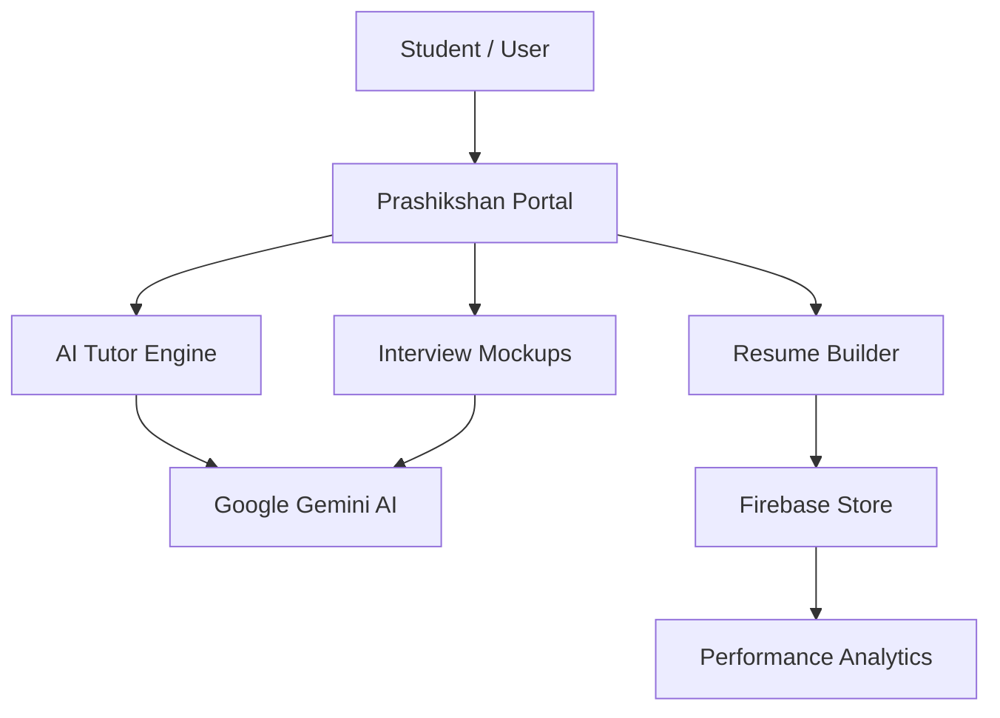

<p align="center">
  
  
  
</p>

<p align="center">
  
  
  
</p>

<p align="center">
  
</p>

<p align="center">
  <b>Empowering Students with AI-Driven Career Readiness</b><br/>
  Prepare for the future of work with personalized tutoring and professional tools.
</p>

<p align="center">
  
</p>

# 🚀 Prashikshan | AI Career Platform

**Prashikshan** is a comprehensive AI-powered educational platform designed to bridge the gap between academic learning and industry requirements. It provides students with personalized career preparation tools, including AI tutoring, resume building, and interview practice.

---

## 💡 The Problem

Students often face a significant gap between what they learn in classrooms and what the industry demands. Personalized career guidance, high-quality interview prep, and professional resume building are often inaccessible or fragmented.

---

## 🎯 Our Mission

To provide a **one-stop AI-driven solution** that mentors students, hones their professional skills, and prepares them for successful careers through cutting-edge technology and personalized insights.

---

## 🏗️ System Architecture



---

## ✨ Key Features

- 🤖 **AI Tutor**: Personalized learning assistance powered by **Google Gemini** to help students master complex concepts.
- 📄 **Resume Builder**: Interactive tool to create professional resumes tailored to industry standards and ATS-friendly.
- 🎙️ **Interview Practice**: AI-driven mock interviews with real-time feedback on performance and domain knowledge.
- 📊 **Student Dashboard**: A centralized hub for tracking progress, assessments, and learning streaks.
- 🎯 **Skill Assessment**: Personalized quizzes and evaluations to identify strengths and areas for improvement.

---

## 🧰 Tech Stack

### 🌐 Frontend & UI

- **React / Vite**: Modern, lightning-fast frontend framework.
- **Tailwind CSS**: For sleek, responsive, and professional styling.
- **Framer Motion**: Smooth, premium animations and transitions.

### 🤖 Intelligence Layer

- **Google Generative AI (Gemini)**: Powering the AI Tutor and Interview modules.
- **Natural Language Processing**: For resume parsing and feedback.

### ⚙️ Backend & Infrastructure

- **Firebase**: Reliable authentication, Firestore database, and secure hosting.
- **TypeScript**: Ensuring type safety and robust code architecture.

---

## 🚀 Getting Started

### Prerequisites

- Node.js (v18 or higher)
- npm or yarn

### Installation

1.  **Clone the project**

    ```bash
    git clone https://github.com/arpita1049/PrashikshanCyberathon.git
    cd prashikshan
    ```

2.  **Install Dependencies**

    ```bash
    npm install
    ```

3.  **Environment Setup**
    Create a `.env` file and add your AI API keys:

    ```env
    VITE_GEMINI_API_KEY=your_key_here
    VITE_FIREBASE_CONFIG=your_config_here
    ```

4.  **Run Locally**
    ```bash
    npm run dev
    ```

---

## 📂 Project Structure

```bash
prashikshan/
├── src/
│   ├── components/       # Reusable UI elements
│   ├── pages/            # Feature pages (Dashboard, Tutor, etc.)
│   ├── services/         # AI & Firebase integration
│   ├── types/            # TypeScript definitions
│   └── App.tsx           # Navigation & Root
├── public/               # Static assets
└── package.json          # Build scripts & Deps
```

---

## 👥 Team Prashikshan

| Name                   | Role                              |
| ---------------------- | --------------------------------- |
| **Arpita Mahale**      | Frontend & UI Developer           |
| **Pranay Patil**       | PPT, Documentation & Coordination |
| **Mrinmayee Kamble**   | AI Model & Integration Engineer   |
| **Krushnamegh Kamble** | Backend Architecture & APIs       |

---

## 🤝 Contributing

We welcome contributions to help make Prashikshan even better! Feel free to open issues or submit pull requests.

---

<p align="center">
  Built with ❤️ for Cyberathon and a Smarter Future.
</p>
